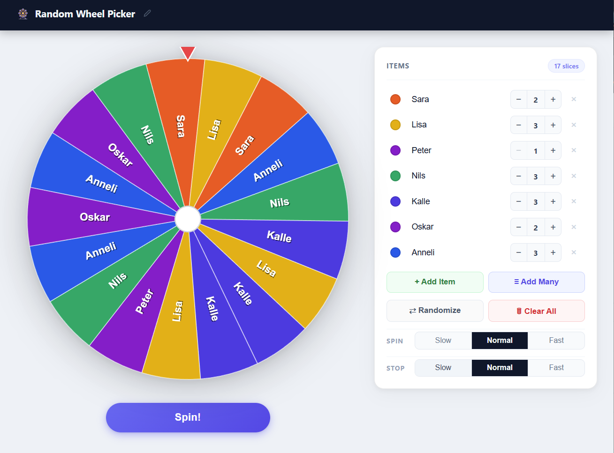

# 🎡 Random Wheel Picker

A game-show-style spinning wheel for making random selections. Add your options, spin the wheel, and let fate decide.

---

## Screenshot

<!-- Replace with actual screenshot -->


---

## What it does

You configure a list of items on the right panel. Each item can be assigned a **slot count** that controls how many slices of the wheel it occupies — giving you weighted probability, so some options can be made more or less likely to win. Each item also gets its own color, either chosen automatically from the palette or set manually. Then you spin the wheel and press Stop whenever you like. The wheel decelerates naturally and lands on a random winner.

### Spinning

- Press **Spin** to start the wheel rotating at high speed
- Press **Stop** to begin decelerating — the coast-down time is randomised every time for suspense
- The **Speed** setting (Slow / Normal / Fast) controls how fast the wheel spins
- When the wheel stops, a modal shows the winning item with options to **Spin Again** or **Remove from wheel** (useful for elimination rounds)

### Managing items

- **Add Item** — adds a single new item to the list
- **Add Many** — opens a dialog where you paste a list of items, one per line; all are added at once
- **Rename** — click any item's name to edit it directly
- **Color** — click the color dot next to an item to choose from the palette or pick a fully custom color
- **Count** — use the − / + stepper to give an item as many slots as you like; an item with 3 slots is three times as likely to win as one with 1 slot
- **Randomize** — scatters the slices randomly so items with multiple slices aren't all grouped together
- **Clear All** — removes every item from the wheel

### Win tracking

Each time an item wins, a 🏆 trophy icon appears next to its name in the list. If it wins multiple times a count badge shows how many times.

### Title

Click the ✏️ pencil icon next to the app title in the header to rename it to anything you like.

---

## Persistence

Everything is saved automatically to `localStorage` — items, counts, custom colors, slice order, and the app title. Your configuration is restored exactly as you left it on every page reload.

---

## Running locally

```bash
npm install
npm run dev
```

Open [http://localhost:5173](http://localhost:5173).

## Building for production

```bash
npm run build   # output goes to dist/
```

